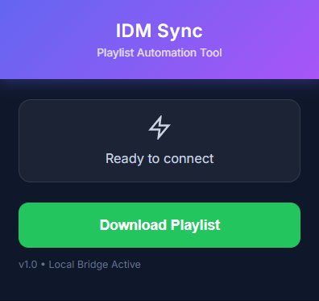

# 🚀 IDM Playlist Automator

A Full-Stack automation tool that bridges Google Chrome and Internet Download Manager (IDM) to enable one-click playlist downloads.

## 🌟 Features
* **One-Click Batch Download:** Grab entire YouTube playlists instantly.
* **Smart Queue System:** Prevents IDM errors using a serial processing buffer.
* **Native Integration:** Uses a local Node.js bridge to control the Windows OS.
* **Parallel Fetching:** Scrapes metadata asynchronously for maximum speed.

## 🛠️ Architecture
* **Frontend:** Chrome Extension (Manifest V3, JS, CSS)
* **Backend:** Node.js (Express, Child Process, REST API)
* **Utilities:** `yt-dlp` (Core Engine), `pkg` (Binary Compilation)

## 📥 Installation Guide

### Step 1: The Bridge App (Backend)
1.  Go to the [Releases Page](https://github.com/sunnyissac18/IDM-Playlist-Automator/releases).
2.  Download **`IDM_Playlist_Tool_v1.1.zip`**.
3.  **Extract the zip file** to a folder on your computer.
4.  Open the folder and run **`IDM_Bridge.exe`**.
    * *Note: Keep this window open while downloading.*

### Step 2: The Extension (Frontend)
1.  Download **`IDM_Extension_v1.0.zip`** from Releases and extract it.
2.  Open Chrome and go to `chrome://extensions`.
3.  Toggle **Developer Mode** (Top Right) -> **ON**.
4.  Click **Load Unpacked** and select the extracted folder.

## 🚀 Usage
1.  Ensure `IDM_Bridge.exe` is running.
2.  Open any YouTube Playlist.
3.  Click the Extension Icon -> **"Download Playlist"**.
4.  Watch your IDM Queue fill up automatically!

---
*Built by Sunny Issac for the Open Source Community.*
